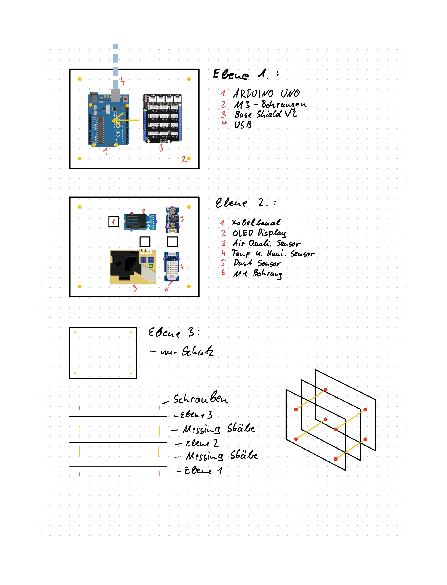
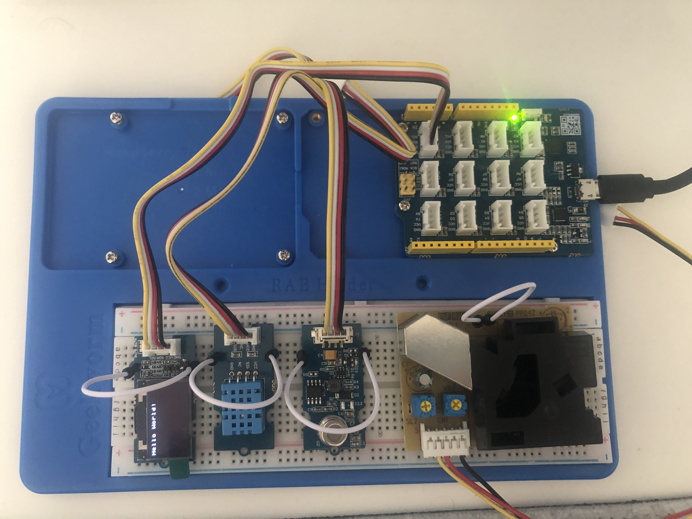
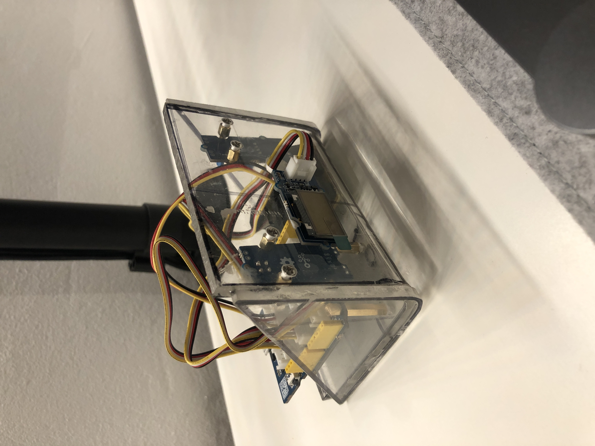
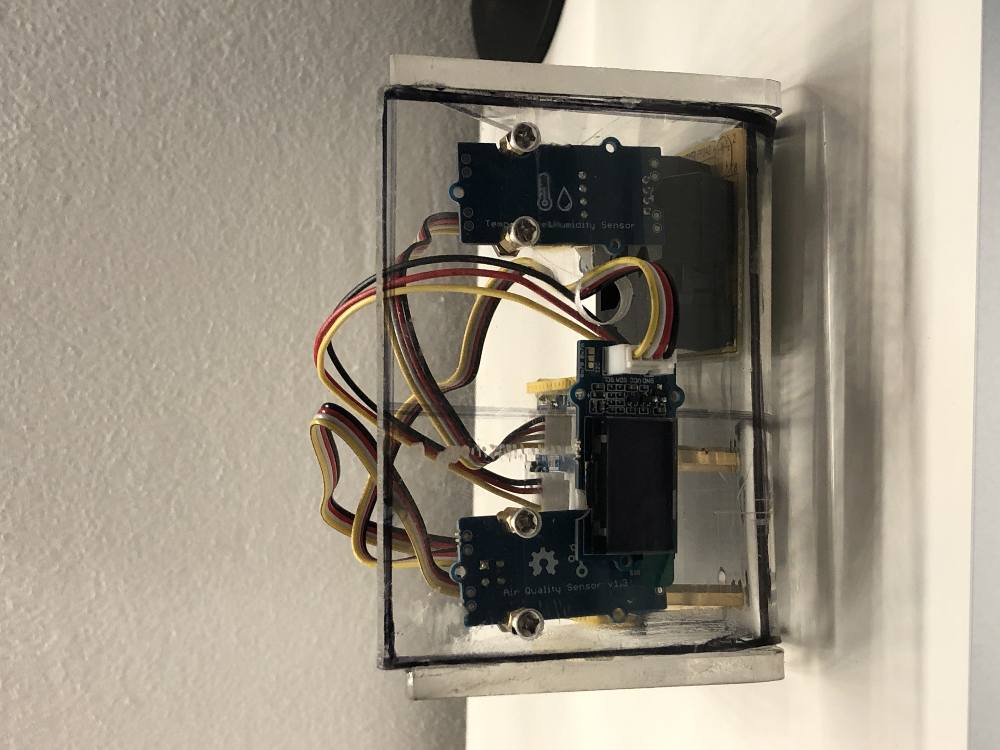
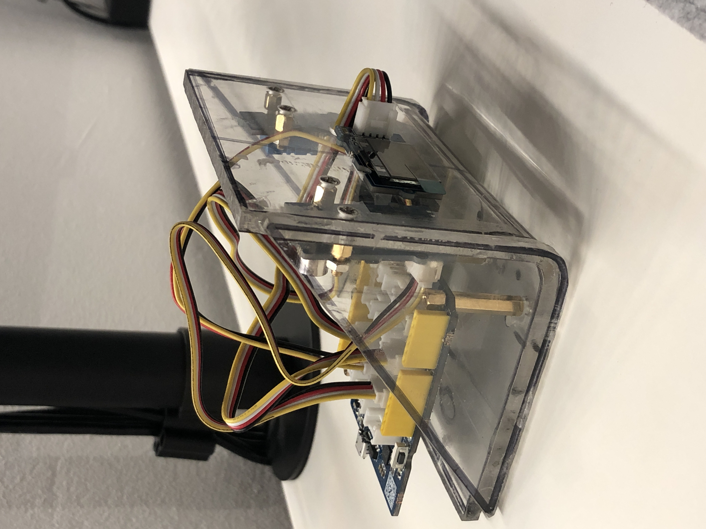

# Projekt Air

This project involves a compact cube made of various components to measure and display indoor air quality. More details will be provided in the different topics:

# Hardware
The following parts are needed for the construction of the project:

|Bauteile        |Kosten| Beschreibung |                      
|----------------|----------------|----------------|
|[Seed Studio Lotus](https://www.seeedstudio.com/Seeeduino-Lotus-ATMega328-Board-with-Grove-Interface-p-1942.html)|20,00€|- The Lotus is needed for programming and has several Grove Connecter built in |
|Plexiglaß| 0,00€|- Plexiglass can be used arbitrarily to build the housing|
|[M3 Messing Gewinde Bolzen](https://www.amazon.de/gp/product/B0825XY6VD/ref=ppx_yo_dt_b_asin_title_o01_s00?ie=UTF8&psc=1)| 11,09€|- Is needed to connect the plexiglass discs|
|[Grove Air Quality Sensor](https://www.seeedstudio.com/Grove-Air-Quality-Sensor-v1-3-Arduino-Compatible.html) |12,99€|- The Grove Air Quality Sensor can detect carbon monoxide, alcohol, acetone, paint thinner, formaldehyde and other mildly toxic gases|
|[Grove Dust Sensor](https://www.seeedstudio.com/Grove-Dust-Sensor-PPD42NS.html) |12,99€|- The Grove Dust Sensor, which can detect not only cigarette smoke but also house dust
|[Grove Temp. & Humi Sensor](https://www.seeedstudio.com/Grove-Temperature-Humidity-Sensor-DHT11.html) | 6,50€|- Measures the temperature and humidity|
|[Grove OLED Display](https://www.seeedstudio.com/Grove-OLED-Display-0-96-SSD1315-p-4294.html) | 5,50€|- Displays all measured values|
|**Summe** |**69,07€** |

# Bauplan Skizze

Dieser Bauplan wurde nicht genau so umgesetzt, da sich Komponenten geändert haben und bei der From des Gehäuses noch experimentiert wurde.

# Step 1. Funktionstest

Alle Komponenten werden auf ihre Funktionstüchtigkeit geprüft und jeder Sensor wird einzelnd getestet

# Step 2. Code anpassung

Alle Komponenten müssen nun in einem Projekt zusammen angesteuert weden und mit Logik verbunden werden. Dazu mehr im [Code](/Code) Ordner

# Step 3. Gehäuse bauen

Wenn alles soweit funktioniert muss das Gehäuse gebaut werden. Dazu werden Plexi Glaß Platten geschnitten und es müssen entsprechend Löcher für die Kabel gelassen werden.

## Prototyp 1.0:

