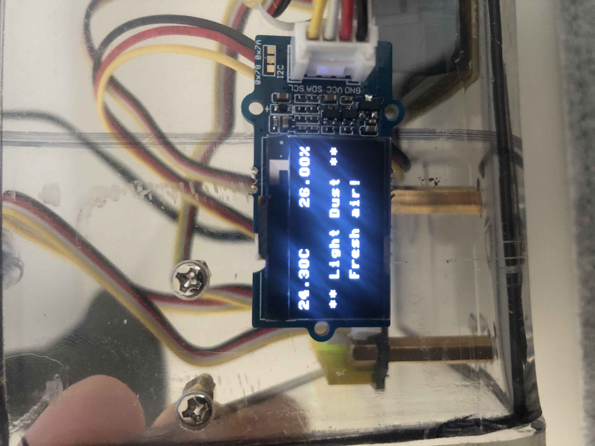

# Projekt Luftsensor

Dieses Projekt umfasst einen kompakten Würfel aus verschiedenen Komponenten um die Raumluft zu messen und darzustellen. Der Luftmesser soll so kompakt wie möglich sein und auf einem Schreibtisch platz finden. Es soll einen Würfel wiederspiegeln der in einem Plexiglaß Gehäuse befindet. Genaue details werden hier bereitgestellt:

# Inhalt

Das Projekt ist in folgende Gebiete unterteilt:

**[Hardware](/Hardware)** | **[Code](/Code)** | **[Dokumentation](/Documentation)** 

