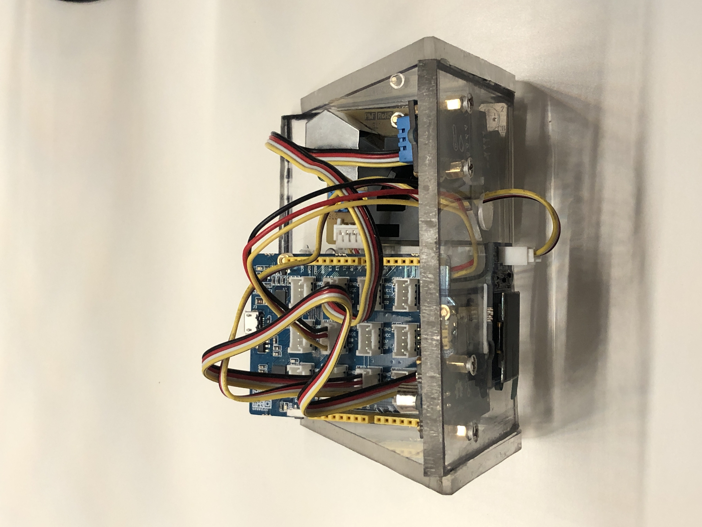

# Projekt Air

This project involves a compact cube made of various components to measure and display indoor air quality. More details will be provided in the different topics:

# Hardware
The following parts are needed for the construction of the project:

|Bauteile        |Kosten| Beschreibung |                      
|----------------|----------------|----------------|
|[Seed Studio Lotus](https://www.seeedstudio.com/Seeeduino-Lotus-ATMega328-Board-with-Grove-Interface-p-1942.html)|20,00€|- The Lotus is needed for programming and has several Grove Connecter built in |
|Plexiglaß| 0,00€|- Plexiglass can be used arbitrarily to build the housing|
|[M3 Messing Gewinde Bolzen](https://www.amazon.de/gp/product/B0825XY6VD/ref=ppx_yo_dt_b_asin_title_o01_s00?ie=UTF8&psc=1)| 11,09€|- Is needed to connect the plexiglass discs|
|[Grove Air Quality Sensor](https://www.seeedstudio.com/Grove-Air-Quality-Sensor-v1-3-Arduino-Compatible.html) |12,99€|- The Grove Air Quality Sensor can detect carbon monoxide, alcohol, acetone, paint thinner, formaldehyde and other mildly toxic gases|
|[Grove Dust Sensor](https://www.seeedstudio.com/Grove-Dust-Sensor-PPD42NS.html) |12,99€|- The Grove Dust Sensor, which can detect not only cigarette smoke but also house dust
|[Grove Temp. & Humi Sensor](https://www.seeedstudio.com/Grove-Temperature-Humidity-Sensor-DHT11.html) | 6,50€|- Measures the temperature and humidity|
|[Grove OLED Display](https://www.seeedstudio.com/Grove-OLED-Display-0-96-SSD1315-p-4294.html) | 5,50€|- Displays all measured values|
|**Summ** |**69,07€** |

# Construction plan sketch

This construction plan was not implemented exactly as it is, since components have changed and experimentation was still going on with the from of the housing.

# Step 1. Function test

All components are tested for functionality and each sensor is tested individually.

# Step 2. Code customization

All components must now be controlled together in a project and connected with logic. More about this in the [Code](/Code) folder

# Step 3. Build housing

If everything works so far, the housing must be built. For this purpose Plexi glass plates are cut and holes must be left for the cables.

## Prototyp 1.0:

